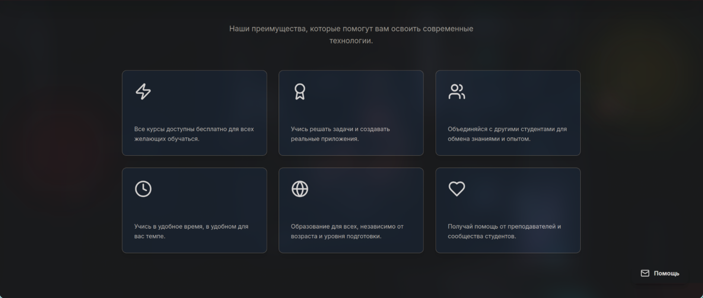
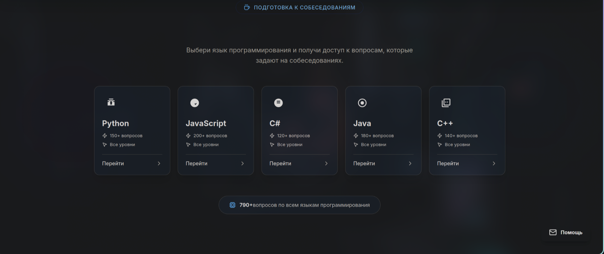
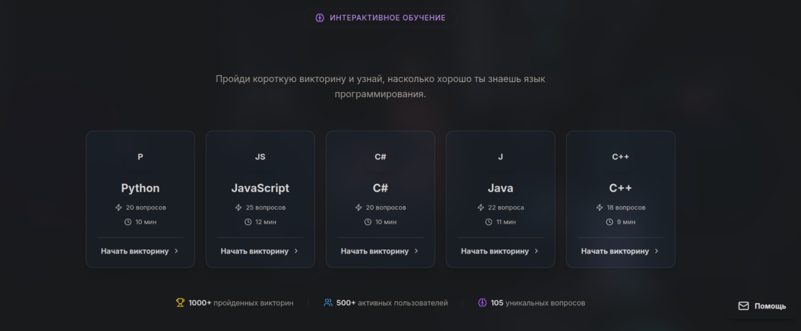

# 🚀 Красный Код — Обучение программированию для всех! ✨


"Красный код" — это **бесплатная** образовательная платформа, предоставляющая доступное и качественное обучение программированию для всех. Разработанная с философией "бесплатное образование для народа", платформа предлагает структурированные курсы, вдохновленные принципами свободного доступа к знаниям.

Мы верим, что доступ к образованию должен быть универсальным и свободным, поэтому "Красный Код" стремится предоставить полноценные знания без каких-либо барьеров.

Проект создан с использованием современных веб-технологий: **React**, **TailwindCSS** и **Vite**, что обеспечивает высокую производительность, модульность и приятный пользовательский интерфейс. Также для бэкенд-части используется мощная современная библиотека [FastAPI](https://github.com/fastapi/fastapi).

---

## 🛠️ Технический стек

### Фронтенд
- **React 19** - Современная библиотека для создания пользовательских интерфейсов
- **React Router v7** - Маршрутизация в приложении
- **TailwindCSS** - Утилитарный CSS-фреймворк для быстрой стилизации
- **Vite 7** - Современный инструмент сборки с молниеносной горячей перезагрузкой
- **Lucide React** - Набор иконок для интерфейса
- **Styled Components** - Библиотека для стилизации компонентов

### Бэкенд
- **FastAPI** - Современный, быстрый (высокопроизводительный) веб-фреймворк для создания API на Python

---

## ✨ Ключевые Возможности

* ✅ **Обширная библиотека бесплатных курсов:** Освойте фундаментальные и продвинутые концепции веб-разработки с курсами по:
    * **HTML & CSS:** Основы верстки и стилизации.
    * **Markdown:** Красивое оформление текста и улучшения своих README.
    * **Python:** Мощный, в то же время легкий язык для всех!
    * **GitHub:** Работа с системой контроля версий.
    * **CSS:** Продвинутая стилизация и анимации.

* 📈 **Интегрированная система заданий и отслеживания прогресса:** Учитесь шаг за шагом, выполняя практические задания и контролируя свой образовательный путь.
* 🎮 **Интерактивные игры и задания:** Закрепите знания с помощью специальных обучающих игр.
* 🌐 **Активное сообщество в Telegram:** Присоединяйтесь к единомышленникам и получайте поддержку в нашем Telegram-канале: **[@Коммунист Этичный Хакер](https://t.me/+ay37cKnFWtg3MDJi)**
* ⚡️ **Современный стек технологий:** Построен на базе **React** для эффективной разработки интерфейса, **TailwindCSS** для быстрого и адаптивного дизайна, и **Vite** для молниеносной сборки.

---

## 📁 Архитектура проекта

```
src/
├── components/          # Переиспользуемые компоненты
├── pages/               # Компоненты страниц
├── admin/               # Админская часть
├── data/                # Данные курсов и уроков
├── routes/              # Конфигурация маршрутов
├── assets/              # Статические файлы
└── services/            # API сервисы
```

### Маршруты
Проект использует модульную систему маршрутизации:
- `routes/public.routes.jsx` - публичные маршруты
- `routes/admin.routes.jsx` - админские маршруты
- `routes/index.jsx` - объединение всех маршрутов

---

## 🚀 Быстрый старт

### Установка зависимостей
```bash
npm install
```

### Запуск в режиме разработки
```bash
npm run dev
```

### Сборка для продакшена
```bash
npm run build
```

### Просмотр продакшн-сборки локально
```bash
npm run preview
```

---

## 📸 Демонстрация

Лучше один раз увидеть, чем сто раз прочитать! Вот несколько скриншотов, демонстрирующих интерфейс и функционал платформы:







---

## 🧑‍💻 Автор и Контакты

Проект разработан **[Ваше имя]** — энтузиастом и разработчиком, глубоко приверженным идее свободного и доступного образования для всех.

* **GitHub:** [@ваше-имя](https://github.com/ваше-имя)
* **Email:** [ваш.email@example.com](mailto:ваш.email@example.com) (опционально)
* **Telegram:** [@ваш_telegram_ник](https://t.me/ваш_telegram_ник) (опционально, если хотите личную связь)

---

## 🤝 Вклад в проект

Мы приветствуем вклад в развитие проекта! Если вы хотите помочь:

1. Форкните репозиторий
2. Создайте ветку для вашей функции (`git checkout -b feature/AmazingFeature`)
3. Зафиксируйте изменения (`git commit -m 'Add some AmazingFeature'`)
4. Запушьте ветку (`git push origin feature/AmazingFeature`)
5. Откройте Pull Request

---

## 📄 Лицензия

Этот проект распространяется под лицензией **MIT**. Вы можете свободно использовать, изменять и распространять этот код в соответствии с условиями лицензии.

Для получения дополнительной информации смотрите файл [LICENSE](LICENSE) в корне репозитория.

---
